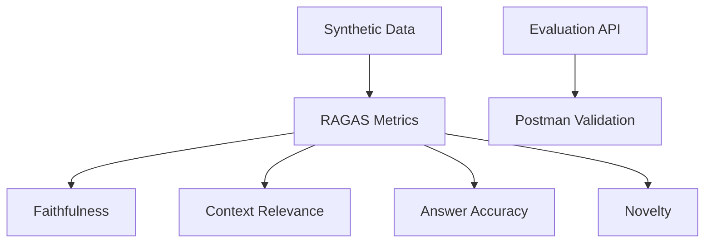

# RAGAS Evaluation Implementation Plan

## Implementation Overview

### Project Structure
```
src/
  evaluation/
    evaluateRagas.js     # Main evaluation script
    metrics/
      faithfulness.js    # Faithfulness scoring
      relevance.js       # Context relevance
      accuracy.js        # Answer accuracy
      novelty.js         # Novelty detection
    utils/
      embedding.js       # Embedding utilities
      textProcessing.js  # Text analysis helpers
    config/
      test_cases.json    # Test data
```

### Key Components


## Technical Specifications

### 1. Standalone Script Setup
**File:** `src/evaluation/evaluateRagas.js`

```javascript
// Required imports and configuration
const { createClient } = require('redis');
const { Configuration, OpenAIApi } = require('openai');
const { readFileSync } = require('fs');
const path = require('path');

// Import existing retrieval pipeline
const { searchImages } = require('../../server');

// Configuration and clients
const redisClient = createClient({
  url: process.env.REDIS_URL
});

const openai = new OpenAIApi(
  new Configuration({
    apiKey: process.env.OPENAI_API_KEY
  })
);

// Load test cases
const testCases = JSON.parse(
  readFileSync(
    path.join(__dirname, 'config', 'test_cases.json')
  )
);

// Main evaluation loop
async function evaluateSystem() {
  const results = [];
  for (const test of testCases) {
    // 1. Run retrieval pipeline
    const { context, answer } = await searchImages(test.question);
    
    // 2. Compute metrics
    const metrics = await computeMetrics(test, context, answer);
    
    // 3. Store results
    results.push({
      question: test.question,
      expectedAnswer: test.groundTruth,
      generatedAnswer: answer,
      retrievedContext: context,
      metrics
    });
  }
  
  // 4. Generate report
  outputResults(results);
}
```

### 2. Faithfulness Implementation
**File:** `src/evaluation/metrics/faithfulness.js`

```javascript
async function computeFaithfulness(answer, context) {
  // 1. Split answer into claims
  const claims = splitIntoClaims(answer);
  
  // 2. Verify each claim
  const verificationResults = await Promise.all(
    claims.map(claim => 
      verifyClaimInContext(claim, context)
    )
  );
  
  // 3. Calculate score
  return {
    score: verificationResults.filter(r => r.supported).length / claims.length,
    unsupportedClaims: claims.filter((_, i) => !verificationResults[i].supported)
  };
}

function splitIntoClaims(text) {
  // Split on sentence boundaries
  const sentences = text.match(/[^.!?]+[.!?]+/g) || [text];
  
  // Further split compound sentences
  return sentences.flatMap(sentence => {
    if (sentence.includes(' and ') || sentence.includes(', ')) {
      return sentence.split(/(?:,\s*|\s+and\s+)/);
    }
    return [sentence];
  });
}

async function verifyClaimInContext(claim, context) {
  // 1. Extract key entities and facts
  const entities = extractEntities(claim);
  const numbers = extractNumbers(claim);
  const dates = extractDates(claim);
  
  // 2. Check presence in context
  const entityMatch = entities.every(e => 
    context.toLowerCase().includes(e.toLowerCase())
  );
  
  const numberMatch = numbers.every(n =>
    context.includes(n)
  );
  
  const dateMatch = dates.every(d =>
    context.includes(d)
  );
  
  // 3. Optional: LLM verification for complex claims
  let llmVerification = true;
  if (claim.length > 50) { // Complex claim
    llmVerification = await verifyWithLLM(claim, context);
  }
  
  return {
    supported: entityMatch && numberMatch && dateMatch && llmVerification,
    evidence: {
      entityMatch,
      numberMatch,
      dateMatch,
      llmVerified: llmVerification
    }
  };
}
```

### 3. Context Relevance Implementation
**File:** `src/evaluation/metrics/relevance.js`

```javascript
async function computeContextRelevance(question, context, retrievalScores) {
  // 1. Vector similarity
  const questionEmbed = await getEmbedding(question);
  const contextEmbed = await getEmbedding(context);
  const vectorScore = cosineSimilarity(questionEmbed, contextEmbed);
  
  // 2. Keyword overlap
  const keywordScore = computeKeywordOverlap(question, context);
  
  // 3. Retrieval precision (if multiple chunks)
  const precisionScore = computePrecision(
    question,
    context.split('\n'),
    retrievalScores
  );
  
  return {
    vectorSimilarity: vectorScore,
    keywordOverlap: keywordScore,
    precision: precisionScore,
    finalScore: (
      vectorScore * 0.6 +
      keywordScore * 0.2 +
      precisionScore * 0.2
    )
  };
}

function computeKeywordOverlap(question, context) {
  const questionTokens = new Set(
    question.toLowerCase()
      .split(/\W+/)
      .filter(t => t.length > 2)
  );
  
  const contextTokens = context.toLowerCase()
    .split(/\W+/)
    .filter(t => t.length > 2);
    
  const overlap = contextTokens
    .filter(t => questionTokens.has(t)).length;
    
  return overlap / questionTokens.size;
}

function computePrecision(question, chunks, scores) {
  // Assuming chunks are ordered by relevance
  const relevantChunks = chunks.filter((chunk, i) => 
    scores[i] > 0.7 || // High vector similarity
    computeKeywordOverlap(question, chunk) > 0.3 // Significant keyword match
  );
  
  return relevantChunks.length / chunks.length;
}
```

### 4. Test Data Structure
**File:** `src/evaluation/config/test_cases.json`

```json
{
  "testCases": [
    {
      "id": "test_001",
      "question": "When was the first Super Bowl?",
      "groundTruth": "The first Super Bowl was played on January 15, 1967.",
      "metadata": {
        "category": "sports_history",
        "difficulty": "easy",
        "expectedContext": ["super bowl", "1967", "first game"]
      }
    },
    {
      "id": "test_002",
      "question": "What are the key features of a RAG system?",
      "groundTruth": "A RAG (Retrieval-Augmented Generation) system combines document retrieval with language model generation. Key features include vector search, context integration, and answer generation.",
      "metadata": {
        "category": "technical",
        "difficulty": "medium",
        "expectedContext": ["RAG", "retrieval", "generation", "vector search"]
      }
    }
  ],
  "config": {
    "minContextLength": 100,
    "maxContextLength": 1000,
    "relevanceThreshold": 0.7,
    "faithfulnessThreshold": 0.9
  }
}
```

## API Integration

### Evaluation Endpoint
```javascript
// server.js
fastify.post('/evaluate', {
  schema: {
    body: {
      type: 'object',
      required: ['queries'],
      properties: {
        queries: {
          type: 'array',
          items: {
            type: 'object',
            required: ['question', 'groundTruth'],
            properties: {
              question: { type: 'string' },
              groundTruth: { type: 'string' },
              metadata: {
                type: 'object',
                properties: {
                  category: { type: 'string' },
                  difficulty: { type: 'string' },
                  expectedContext: { 
                    type: 'array',
                    items: { type: 'string' }
                  }
                }
              }
            }
          }
        },
        options: {
          type: 'object',
          properties: {
            detailed: { type: 'boolean' },
            metrics: {
              type: 'array',
              items: {
                type: 'string',
                enum: ['faithfulness', 'relevance', 'accuracy', 'novelty']
              }
            }
          }
        }
      }
    }
  },
  handler: async (request, reply) => {
    const results = await Promise.all(
      request.body.queries.map(async query => {
        // 1. Run retrieval and generation
        const { context, answer } = await searchImages(query.question);
        
        // 2. Compute requested metrics
        const metrics = {};
        if (request.body.options?.metrics?.includes('faithfulness')) {
          metrics.faithfulness = await computeFaithfulness(answer, context);
        }
        if (request.body.options?.metrics?.includes('relevance')) {
          metrics.relevance = await computeContextRelevance(
            query.question,
            context
          );
        }
        // ... other metrics
        
        // 3. Return detailed or summary response
        return request.body.options?.detailed
          ? {
              question: query.question,
              groundTruth: query.groundTruth,
              generatedAnswer: answer,
              retrievedContext: context,
              metrics
            }
          : {
              question: query.question,
              metrics: Object.fromEntries(
                Object.entries(metrics).map(([k, v]) => [k, v.score])
              )
            };
      })
    );
    
    return { results };
  }
});
```

## Testing Strategy

### Postman Test Suite
**Collection Structure:**
```json
{
  "info": {
    "name": "RAGAS Evaluation Tests",
    "description": "API tests for RAG system evaluation"
  },
  "item": [
    {
      "name": "Evaluate Known Answer",
      "request": {
        "method": "POST",
        "url": "{{base_url}}/evaluate",
        "body": {
          "mode": "raw",
          "raw": {
            "queries": [{
              "question": "When was the first Super Bowl?",
              "groundTruth": "January 15, 1967"
            }],
            "options": {
              "detailed": true,
              "metrics": ["faithfulness", "relevance"]
            }
          }
        }
      },
      "test": [
        "pm.test('Response structure is valid', function() {
          const response = pm.response.json();
          pm.expect(response).to.have.property('results');
          pm.expect(response.results).to.be.an('array');
          pm.expect(response.results[0]).to.have.property('metrics');
        })",
        "pm.test('Faithfulness meets threshold', function() {
          const metrics = pm.response.json().results[0].metrics;
          pm.expect(metrics.faithfulness.score).to.be.above(0.9);
        })",
        "pm.test('Context is relevant', function() {
          const metrics = pm.response.json().results[0].metrics;
          pm.expect(metrics.relevance.finalScore).to.be.above(0.7);
        })"
      ]
    }
  ]
}
```

## Environment Requirements

```bash
# Required Environment Variables
OPENAI_MODEL=gpt-4-0125-preview
MAX_CONTEXT_LENGTH=4096
EVAL_CACHE_TTL=3600 # 1 hour
REDIS_URL=redis://localhost:6379
VECTOR_INDEX_NAME=images_idx
MIN_RELEVANCE_SCORE=0.7
BATCH_SIZE=10
```

## Risk Mitigation

### 1. API Rate Limiting
```javascript
// src/evaluation/utils/rateLimiting.js
class RateLimiter {
  constructor(maxRequests, timeWindow) {
    this.requests = [];
    this.maxRequests = maxRequests;
    this.timeWindow = timeWindow;
  }
  
  async waitForCapacity() {
    const now = Date.now();
    this.requests = this.requests.filter(
      time => now - time < this.timeWindow
    );
    
    if (this.requests.length >= this.maxRequests) {
      const oldestRequest = this.requests[0];
      const waitTime = this.timeWindow - (now - oldestRequest);
      await new Promise(resolve => 
        setTimeout(resolve, waitTime)
      );
    }
    
    this.requests.push(now);
  }
}

// Usage in evaluation
const rateLimiter = new RateLimiter(20, 60000); // 20 requests per minute
async function evaluateWithRateLimit() {
  for (const test of testCases) {
    await rateLimiter.waitForCapacity();
    // ... run evaluation
  }
}
```

### 2. Error Handling
```javascript
// src/evaluation/utils/errorHandling.js
async function withRetry(operation, maxRetries = 3) {
  let lastError;
  for (let i = 0; i < maxRetries; i++) {
    try {
      return await operation();
    } catch (error) {
      lastError = error;
      if (error.response?.status === 429) {
        // Rate limit hit, wait longer
        await sleep(Math.pow(2, i) * 1000);
        continue;
      }
      if (error.response?.status >= 500) {
        // Server error, retry
        await sleep(1000);
        continue;
      }
      // Client error or other, don't retry
      throw error;
    }
  }
  throw lastError;
}

// Usage
const result = await withRetry(() =>
  openai.createEmbedding({
    model: "text-embedding-ada-002",
    input: text
  })
);
```

## Cross-Platform Considerations

### Windows Setup
1. **File Paths**
```javascript
// src/evaluation/utils/paths.js
const { join } = require('path');

const CONFIG_DIR = join(__dirname, '..', 'config');
const TEST_CASES_PATH = join(CONFIG_DIR, 'test_cases.json');
const RESULTS_DIR = join(__dirname, '..', 'results');

// Create results directory if it doesn't exist
if (!existsSync(RESULTS_DIR)) {
  mkdirSync(RESULTS_DIR, { recursive: true });
}
```

2. **Redis Connection**
```javascript
// src/evaluation/utils/redis.js
const { createClient } = require('redis');

async function getRedisClient() {
  const client = createClient({
    url: process.env.REDIS_URL,
    socket: {
      reconnectStrategy: (retries) => {
        if (retries > 10) {
          throw new Error('Redis connection failed');
        }
        return Math.min(retries * 100, 3000);
      }
    }
  });
  
  await client.connect();
  return client;
}
```

3. **PowerShell Setup Script**
```powershell
# setup.ps1
$env:REDIS_URL = "redis://localhost:6379"
$env:OPENAI_API_KEY = "your-key-here"
$env:VECTOR_INDEX_NAME = "images_idx"

# Install dependencies
npm install

# Run evaluation
node src/evaluation/evaluateRagas.js
```

This detailed implementation plan provides clear guidance for:
1. Setting up the evaluation environment
2. Implementing each RAGAS metric
3. Structuring test data
4. Handling API integration
5. Managing cross-platform compatibility
6. Error handling and rate limiting

Follow the file structure and implementation details above to create a robust evaluation system for your RAG implementation.
