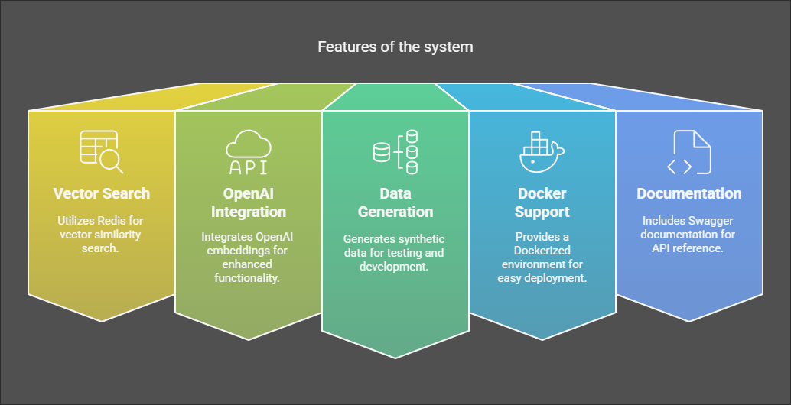

# Image Metadata Search API



## Features
- Vector similarity search using Redis
- OpenAI embeddings integration
- Synthetic data generation
- Dockerized environment
- Swagger documentation

## Quick Start
```bash
docker-compose up --build
```

## API Endpoints

### Create Image Record
```bash
curl -X POST http://localhost:3000/images \
  -H "Content-Type: application/json" \
  -d '{"id": "sunset", "description": "Vibrant sunset over mountains"}'
```

### Search Similar Images
```bash
curl -X POST http://localhost:3000/search \
  -H "Content-Type: application/json" \
  -d '{"text": "colorful landscape"}'
```

### Generate Synthetic Data
```bash
# Generate 1000 items with batch operations
curl -X POST http://localhost:3000/seed \
  -d '{"count": 1000, "batchSize": 100, "wipeExisting": true}'
```

### System Health Check
```bash
curl http://localhost:3000/health
```

## Search Command Usage

Run semantic searches through CLI:
```bash
npm run search -- --text="mountain sunset" --limit=3
```

Parameters:
- `--text`: Required search query
- `--limit`: Optional results count (default: 5)

## Postman Testing
1. Import collection and environment files
2. Set environment variables:
   - `search_text`: Query text
   - `search_limit`: Max results (1-10)
3. Run "Search by Text" request

## Environment Variables
| Variable | Description |
|----------|-------------|
| `OPENAI_API_KEY` | Required for real embeddings |
| `VECTOR_DISTANCE` | `COSINE` (default) or `L2` |
| `BATCH_SIZE` | Records per insert batch (default: 50) |

## Development
```bash
# Run with live reload
npm run dev

# Build Docker image
docker-compose build

# Access Redis CLI
docker exec -it rag-img-search-redis-1 redis-cli
```

[Full API Documentation](http://localhost:3000/docs)
